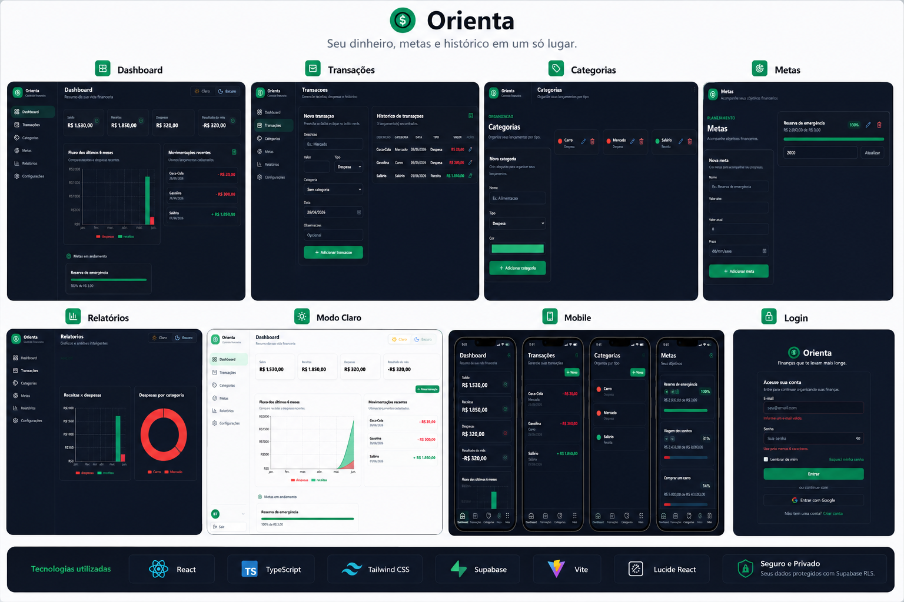

# Orienta

A modern personal finance management app built with React, TypeScript, Vite, Tailwind CSS and Supabase.



## Features

- Email and password authentication with Supabase Auth
- Protected routes with React Router
- Financial dashboard with balance, income and expenses
- Transaction management
- Category management
- Financial goals
- Reports and charts
- Light and dark mode
- Responsive layout
- Row Level Security to keep each user’s data private

## Tech Stack

- React
- TypeScript
- Vite
- Tailwind CSS
- Supabase
- React Router
- React Hook Form
- Zod
- Recharts
- Lucide React

## Getting Started

### 1. Install dependencies

```bash
npm install
```

### 2. Configure Supabase

Create a project on Supabase and run the SQL file located at:

```txt
supabase/schema.sql
```

### 3. Create environment variables

Create a `.env` file based on `.env.example`:

```bash
cp .env.example .env
```

Then add your Supabase credentials:

```env
VITE_SUPABASE_URL=your-supabase-url
VITE_SUPABASE_ANON_KEY=your-supabase-anon-key
```

### 4. Run the project

```bash
npm run dev
```

## Project Structure

```txt
src/
  components/
  contexts/
  hooks/
  lib/
  pages/
  schemas/
  services/
  types/
  utils/

supabase/
  schema.sql
```

## Security

The app uses Supabase Auth and Row Level Security policies to ensure users can only access their own data.

## Status

This project is under development and was created as part of a personal portfolio.